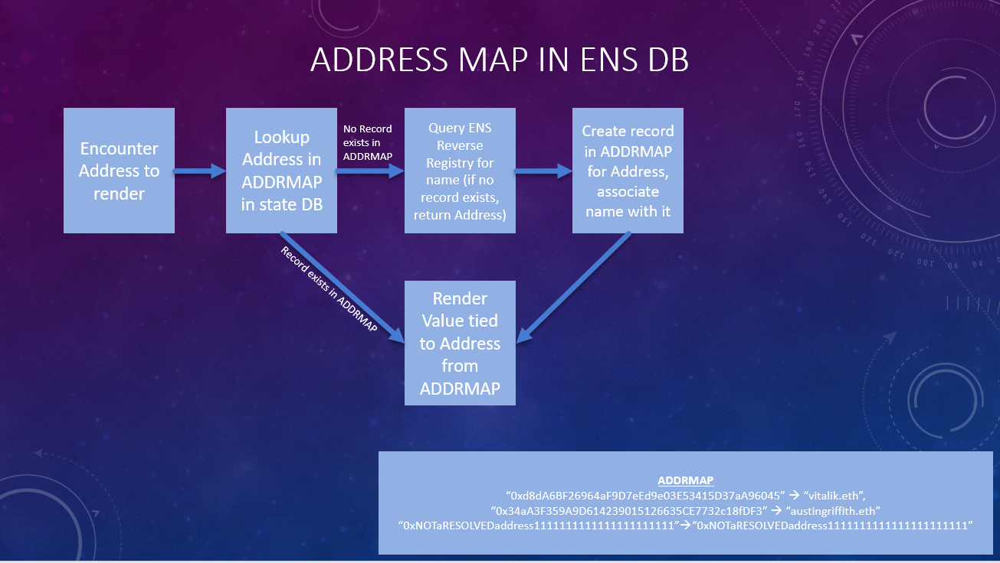

# GR10-ENS-integration
GR10 Hackathon ENS integration project into Meme Factory

For an overview of the code repo, please visit the following summary youtube video:

[https://www.youtube.com/watch?v=vj0cfPCMVU0](https://www.youtube.com/watch?v=vj0cfPCMVU0)

# Running Code

Clone repo locally, go into file src/cljs/my_re_frame/db.cljs and update the following line to replace <INFURA_API_KEY_HERE> with your own infura api key:

:w3 (web3/create-web3 "https://mainnet.infura.io/v3/<INFURA_API_KEY_HERE>")

Or, create your own web3 instance and assign it to the :w3 attribute of the app state db. 

To run the code, go to a command prompt, and enter:

>lein figwheel

This will pull in the necessary dependencies (or, call lein deps to force this) and load the app. The app will be availabile, by default, at http://localhost:3449/

# Problem Scope

As defined in the Memefactory hackathon bounty specified for Gitcoin's Round 10 Grant funding:

"To improve UX of MemeFactory, user addresses throughout the app should reverse-resolve into ENS names, if any assigned."

# Solution

In this code repo, I have added a function to reverse-resolve an address, as well as a way of collecting all of the reverse-resolved addresses into a map within the app-db state. 

The address registry is a map containing entries of the unique keys corresponding to the addresses to be resolved. When a new entry is added, the address string is the key, and the value is the queried ens resolved name, or a copy of the address string if there is not a reverse registrar entry for the address.

A rendered view of the component (ens name or default address value) can then be substituted into the locations in the current code base.